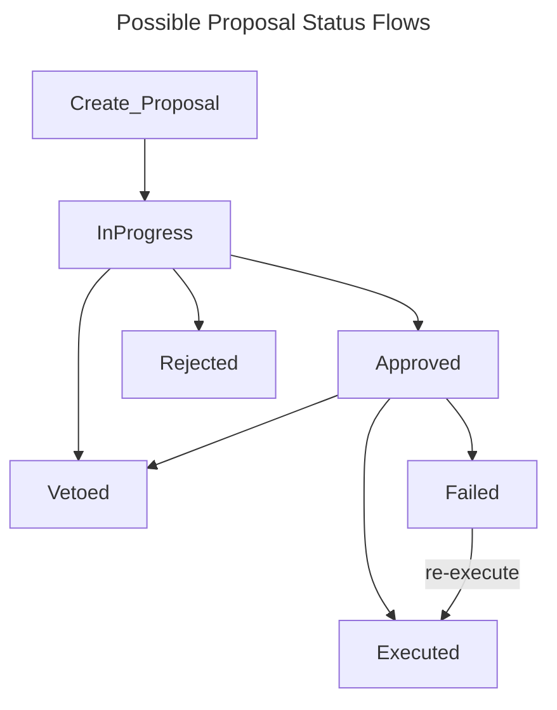

# Congress

- [Diagrams](https://miro.com/app/board/uXjVMqJRr_U=/)
- [Framework Specification](https://near-ndc.notion.site/NDC-V1-Framework-V3-1-Updated-1af84fe7cc204087be70ea7ffee4d23f?pvs=4)

## Creating a Proposal

Each Congress house specifies which proposal kinds are allowed to be created. It is a subset of:

- `FunctionCall`: if approved, proposal execution will create a cross contract call.
- `Text`: text based proposal, no automated action is performed.
- `FundingRequest(Balance)`: request to fund a specific project. Balance is the amount of Near provided as funding. If Balance is bigger or equal than `big_funding_threshold` then it is eligible for `VetoBigOrReccurentFundingReq`. Proposal execution will fail if the total budget spend (including the one from the proposal) goes above the `contract.budget_cap`.
  NOTE: The contract doesn't track the monthly budget limit. That should be tracked off-chain.
- `RecurrentFundingRequest(Balance)`: funding request that will renew every month until the end of the terms. The balance parameter is the size of the single month spending for this funding request. The proposal is eligible for
  `VetoBigOrReccurentFundingReq`. Proposal execution will fail if the total budget spend (including the one from the proposal multiplied by the amount of remaining months) goes above the `contract.budget_cap`.
- `DismissAndBan(member, house)`: requests I Am Human registry to ban the member account (set `GovBan` flag in the IAH registry) and calls the dismiss hook on the house.

Each proposal comes with a description, which should provide motivation and a background.

### Cheat sheet

Below we present how to make a proposal for every possible Congress motion:

#### Veto

Veto is created by a separate account or DAO that has a permission to call the `veto_hook`. `VetoAll` permission allows to veto any proposal, while `VetoBigOrReccurentFundingReq` only allows to veto recurrent funding proposals or funding proposals above `big_funding_threshold`.
In NDC Gov v1 the following entities have permission to veto HoM proposals:

- `voting-body-v1.ndc-gwg.near`: `VetoBigOrReccurentFundingReq`
- `congress-coa-v1.ndc-gwg.near`: `VetoAl`

To create a veto within the congress houses, use the `create_proposal` function:

```rust
kind: PropKind::FunctionCall {
    receiver_id: HoM contract address,
    actions: ActionCall {
        method_name: "veto_hook",
        args: {id: "proposal_id to be vetoed"},
        deposit: U128,
        gas: U64,
    }
}
```

See also the `Voting Body` documentation.

#### Dismiss

To initiate a dismiss, the executing house must possess the appropriate `Dismiss` permission. Under this framework, the authority to dismiss any member of the `HoM` and `CoA` rests with the `TC` (Transparency Commision).

To propose a dismiss proposal, utilize the `create_proposal` function with the following parameters:

```rust
kind: PropKind::FunctionCall {
    receiver_id:  "house_address.near",
    actions: ActionCall {
        method_name: "dismiss_hook",
        args: {member: "member_to_dismiss.near"},
        deposit: U128,
        gas: U64,
    }
}
```

This proposal creation is exclusive to members of the `TC`. If the consensus within the `TC` is to dismiss a member the member will be removed from their power to vote.

#### Dismiss and Ban

To initiate a dismiss and ban action, the executing house must possess the appropriate `DismissAndBan` permission. Under this framework, the authority to dismiss any member of the `HoM` and `CoA` rests with the `TC` (Transparency Commision).

To propose a dismiss and ban proposal, utilize the `create_proposal` function with the following parameters:

```rust
kind: PropKind::DismissAndBan {
    member: "member_to_dismiss_and_ban.near",
    house:  "house_address.near"
}
```

This proposal creation is exclusive to members of the `TC`. If the consensus within the `TC` is to dismiss and ban a member the member will be removed from their power to vote and banned.

## Proposal Lifecycle

When a proposal is created it will have `InProgress` status and the `submission_time` will be set.



### Voting

Any member can vote for any `InProgress` proposal. Members can't overwrite their votes. Proposal is in progress until:

- all votes were cast
- OR `vote_duration` passed
- OR `min_vote_duration` passed and the tally can be finalized (proposal reached min amount of approval votes or have enough abstain + reject votes to block the approval).

### Vetoing

Any proposal can be vetoed (even an in progress one) until the cooldown is over.
A DAO `A` can veto a proposal `P` of house `H` if:

- `P` cooldown is not over (is in progress, approved or rejected).
- `H` gives veto permission to `A`: `contract.hook_auth[A]` contains `VetoAll` or `VetoBigOrReccurentFundingReq`. The latter will only allow `A` to veto big funding proposals or recurrent funding proposals.

### Execution

Anyone (not only a house member) can execute a proposal when a proposal that is:

- min vote duration passed;
- cooldown is over;
- proposal is _approved_ or _failed_.

A proposal is **approved** when:

- is not in progress;
- AND got enough #approved votes (`>= contract.threshold`).

Proposal reaches _failed_ status when it was approved, but the execution failed. In that can be re-executed again.

If proposal execution breaks an invariant check (eg: crossing the budget cap), then the transaction will succeed and a composed error will be returned: the `Ok(Err(ExecRespErr::**))` of `Result<PromiseOrValue<Result<(), ExecRespErr>>, ExecError>` type.

## Queries

- `get_proposals`: Query all proposals

  - `near view $CTR get_proposals '{"from_index": 0, "limit": 10}'`

- `get_proposal`: Query a specific proposal

  - `near view $CTR get_proposal '{"id": 1}'`

- `number_of_proposals`: Query a specific proposal

  - `near view $CTR number_of_proposals ''`

- `is_dissolved`: Check if contract is dissolved

  - `near view $CTR is_dissolved ''`

- `get_members`: Query all members with permissions

  - `near view $CTR get_members ''`

- `member_permissions`: Returns permissions for a specific member

  - `near view $CTR member_permissions '{"member": "user.testnet"}'`

- `hook_permissions`: Returns permissions for a specific member
  - `near view $CTR hook_permissions '{"user": "user.testnet"}'`
