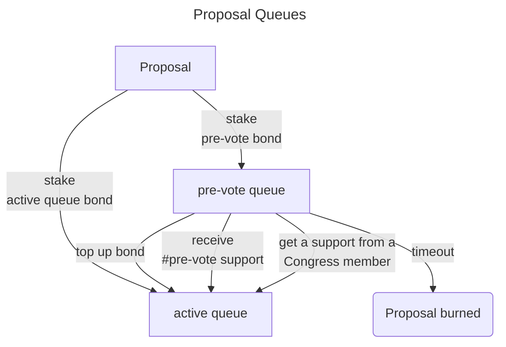

# Voting Body

- [Diagrams](https://miro.com/app/board/uXjVMqJRr_U=/)
- [Framework Specification](https://www.notion.so/NDC-V1-Framework-V3-2-Updated-1af84fe7cc204087be70ea7ffee4d23f)

Voting Body is governance structure of all non-blacklisted human participants in the NEAR Ecosystem. There are no requirements for being a member of the voting body beyond completing ‘I am Human’ and not being on the blacklist.

Parameters:

- `quorum`: a minimum amount of members that need to vote to approve a proposal.
- `pre_vote_support`: minimum amount of support, a proposal has to receive in order to move it to the active queue, where users can vote to approve a proposal.
- `pre_vote_duration`: max amount of time, users can express support to move a proposal to the active queue, before it will be removed.
- `pre_vote_bond`: amount of N required to add a proposal to the pre-vote queue.
- `active_queue_bond`: amount of N required to move a proposal directly to the active queue.
- `voting_duration`: max amount of time a proposal can be active in the active queue. If a proposal didn't get enough approvals by that time, it will be removed and bond returned.

## Creating proposals

Every human can create a proposal. The proposals are organized in 2 queues (pre-voting queue and active queue) in order to filter out spam proposals.
When creating a proposal, the submitter must stake a bond. If `pre-vote bond` is attached, then the proposal goes to the pre-voting queue. If active queue bond is attached then the proposal goes directly to active queue.

### Pre-voting queue

Proposals in this queue are not active. VB members can't vote for proposals in the pre-vote queue and UI doesn't display them by default. Instead, members can send a _pre_vote_support_ transaction. There are 3 ways to move a proposal to the active queue:

- get pre-vote support;
- top up with more NEAR to reach `active_queue_bond`;
- get a support by one of the Congress members using `support_proposal_by_congress`.

If a proposal doesn't meet the conditions to move to the active queue, then the proposal is removed and the bond is moved to a community fund. For overdue proposals, anyone can call `remove_pre_vote_prop` method to do the cleanup and slash. To incentivize it, `REMOVE_REWARD` is deduced from the bond and sent to the caller.

Note: originally only a congress support was required to move a proposal to the active queue. However, that creates a strong subjectivity and censorship (example: VB wants to dismiss a house - obviously house may not be happy and not "support" such a proposal).

### Active queue

Proposals in this queue are eligible for voting and displayed by the default in the UI. Proposals from the active queue are not removed unless they are marked as spam (more about it in the voting section). They are preserved and anyone can query them, even when a proposal was rejected.

When a proposal is moved from the pre-voting queue to the active queue, the set of accounts that supported the proposal is cleared - it's not needed any more. We can save the space and proposal load time.

### Proposal Types

There are several types of proposals with specific functionalities and limitations:

1. **Dismiss Proposal**

   - **Arguments:** `dao`: `AccountId`, `member`: `AccountId`
   - **Description:** This proposal calls the `Dismiss` hook in the provided DAO when executed, resulting in the removal of the specified member.

2. **Dissolve Proposal**

   - **Arguments:** `dao`: `AccountId`
   - **Description:** Executing this proposal triggers the `Dissolve` hook in the provided DAO, dissolving the DAO itself.

3. **Veto Proposal**

   - **Arguments:** `dao`: `AccountId`, `prop_id`: `u32`
   - **Description:** When executed, this proposal invokes the `Veto` hook in the provided DAO and vetoes the proposal identified by the specified `prop_id`.

4. **Approve Budget Proposal**

   - **Arguments:** `dao`: `AccountId`, `prop_id`: `u32`
   - **Description:** This type of proposal serves as an approval mechanism for budget proposals without making any method calls.

5. **Text Proposal**

   - **Description:** A text proposal for general purposes, without specific arguments. It doesn't involve any method calls.

6. **FunctionCall Proposal**
   - **Arguments:** `receiver_id`: `AccountId`, `actions`: `Vec<ActionCall>`
   - **Description:** This proposal enables you to call the `receiver_id` with a list of method names in a single promise. It allows your contract to execute various actions in other contracts, excluding congress contracts. Attempting to create a proposal that calls any congress DAOs will result in an error, preventing the proposal from being created.

## Voting

Any VB member can vote on any _in progress_ proposal in the active queue. Voter can change his/her vote multiple times. Vote options:

- approve
- reject
- spam: strong conviction that the proposal is spam, should be removed and a deposit slashed.

A proposal voting is in progress when `now <= proposal.start_time + voting_duration`, where `proposal.start_time` is a time when the proposal is added to the active queue.

Syntax: #vote_type denotes number of votes of the specified type, eg: #approve means number of approve votes.

A proposal is **approved** when:

- voting time is over;
- AND consent is reached (quorum + threshold).

A proposal is marked as **spam** when:

- voting time is over;
- `#spam > #reject`;
- AND `#reject + #spam >= (1-threshold) * (#approve + #reject + #spam)`.

Spam proposals are removed, and the bond is slashed (sent to the community treasury).

A proposal is **rejected** if voting time is over (proposal is not in progress anymore), and it was not approved nor marked as spam.

Voting Body intentionally doesn't support optimistic execution, that is approving or rejecting a proposal once sufficient amount of votes are cast. We want to give a chance to every member vote and express their opinion providing more clear outcome of the voting.

### Quorums and Thresholds

**Quorum** assures that enough of the VB members voted.
**Majority Threshold** assures that enough VB members approved a proposal. It is a fractional value. Proposal is approved when: `#approve > threshold * (#approve + #reject + #spam)`. It is either a simple majority or a super majority.

- **Near Consent:** quorum=(7% of the voting body) + **simple majority**=50%.
- **Near Supermajority Consent**: quorum=(12% of the voting body) + **super majority**=60%.
