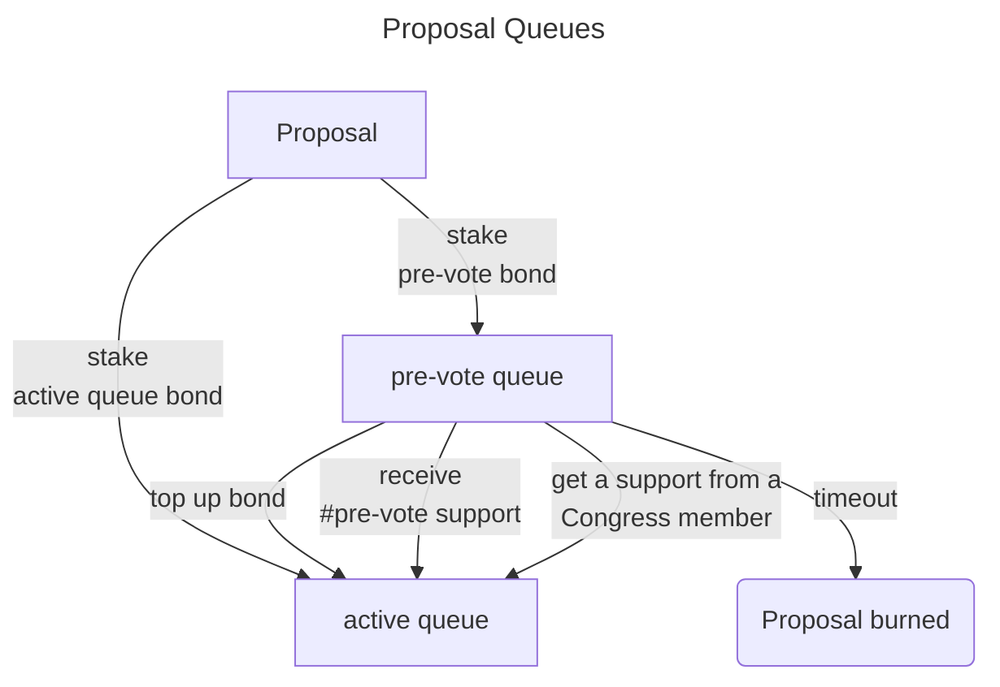

# Voting Body

- [Diagrams](https://miro.com/app/board/uXjVMqJRr_U=/)
- [Framework Specification](https://www.notion.so/NDC-V1-Framework-V3-2-Updated-1af84fe7cc204087be70ea7ffee4d23f)

Voting Body is governance structure of all non-blacklisted human participants in the NEAR Ecosystem. There are no requirements for being a member of the voting body beyond completing ‘I am Human’ and not being on the blacklist.

Parameters:

- `quorum`: a minimum amount of members that need to vote to approve a proposal.
- `pre_vote_support`: minimum amount of support, a proposal has to receive in order to move it to the active queue, where users can vote to approve a proposal.
- `pre_vote_duration`: max amount of time, users can express support to move a proposal to the active queue, before it will be removed.
- `pre_vote_bond`: amount of N required to add a proposal to the pre-vote queue.
- `active_queue_bond`: amount of N required to move a proposal directly to the active queue.
- `voting_duration`: max amount of time a proposal can be active in the active queue. If a proposal didn't get enough approvals by that time, it will be removed and bond returned.

## Creating proposals

Every human can create a proposal. The proposals are organized in 2 queues (pre-voting queue and active queue) in order to filter out spam proposals.
When creating a proposal, the submitter must stake a bond. If `pre-vote bond` is attached, then the proposal goes to the pre-voting queue. If active queue bond is attached then the proposal goes directly to active queue.

### Pre-voting queue

Proposals in this queue are not active. VB members can't vote for proposals in the pre-vote queue and UI doesn't display them by default. Instead, members can send a _pre_vote_support_ transaction. Proposal is moved to the active queue when:

- reaches pre-vote support
- is topped up with more NEAR to reach `active_queue_bond`
- is supported by one of the Congress members

If a proposal doesn't meet the conditions to move to the active queue, then the `pre_vote_bond` is moved to a community fund (if the bond is higher, then the reminder is send back to the proposer).

### Active queue

This is the main set of proposals. Proposals in this queue are eligible for voting and displayed by the default in the UI. Proposals from the active queue are not removed unless they are marked as spam (see details). They are preserved and anyone can query them, even when a proposal was rejected.

## Voting

Any VB member can vote on any _in progress_ proposal in the active queue. Voter can change his/her vote multiple times. Vote options:

- approve
- reject
- spam: strong conviction that the proposal is spam, should be removed and a deposit slashed.

A proposal voting is in progress when `now <= proposal.start_time + voting_duration`, where `proposal.start_time` is a time when the proposal is added to the active queue.

Syntax: #vote_type denotes number of votes of the specified type, eg: #approve means number of approve votes.

A proposal is **approved** when:

- voting time is over
- AND consent is reached (quorum + threshold).

A proposal is marked as **spam** when:

- `#spam > #reject`
- AND `#reject + #spam >= (1-threshold) * (#approve + #reject + #spam)`

Spam proposals are removed, and the bond is slashed (sent to the community treasury).

A proposal is **rejected** if voting time is over (proposal is not in progress any more), and it was not approved nor marked as spam.

### Quorums and Thresholds

**Quorum** assures that enough of the VB members voted.
**Threshold** assures that enough VB members approved a proposal. It is defined as a minimum ratio of #approve votes over all votes to approve a proposal: `#approve > threshold * (#approve + #reject + #spam)`. It is either a simple majority or a super majority.

- **Near Consent:** quorum=(7% of the voting body) + **simple majority**=50% .
- **Near Supermajority Consent**: quorum=(12% of the voting body) + **super majority**=60%.
